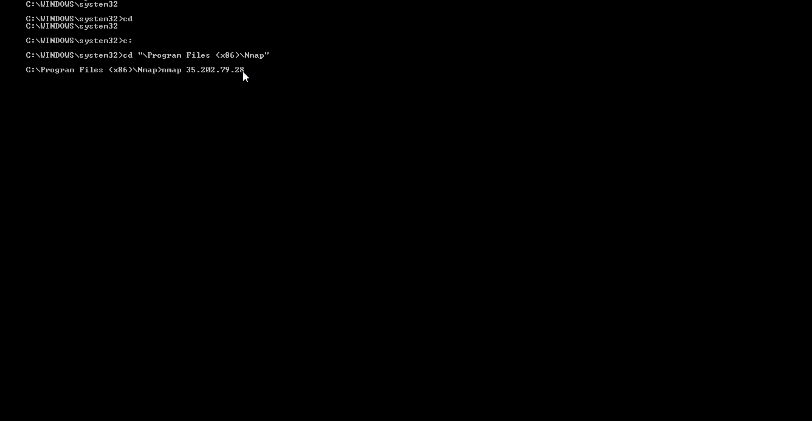

# WebSecurity Project Week 9- Honeypot

Time Spend: 10 hours in total

> Objective: Setup a honeypot and intercept some attempted attacks in the wild.

## Honeypot Information
Honeypot Deployed:Honeypot (Dionaea with HTTP)

## Walkthrough of Attack and Detection
Steps:
I. nmap the External Ip of the Honeypot.
II. Go to the Admin Dashboard and the new Attack should be displayed.
 

## Notes
I. Faced Alot of issue with the installlation part specially with setting up the firewall on windows. It just kept me waiting for a very long time (over 30 mins).
II. Milestone also took longer tha expected: (About an hour and 20 minutes).
III. Getting through the Firewall also took some time.
IV. Was unable to extract the json files at first. The commands didnt work on my device at first (had to write sudo mongoexport --db mnemosyne --collection session > session.json to get around it).

## License

    Copyright [2018] [Sebastian Henriquez]

    Licensed under the Apache License, Version 2.0 (the "License");
    you may not use this file except in compliance with the License.
    You may obtain a copy of the License at

        http://www.apache.org/licenses/LICENSE-2.0

    Unless required by applicable law or agreed to in writing, software
    distributed under the License is distributed on an "AS IS" BASIS,
    WITHOUT WARRANTIES OR CONDITIONS OF ANY KIND, either express or implied.
    See the License for the specific language governing permissions and
    limitations under the License.
